````
# 🚀 Event & Webinar Engagement Booster

> **Built for:** AI Agent Hackathon 2025  
> **Developer:** Goutham Vaishnav  
> **AI Agent Name:** EventMate — Your Smart Attendee Engagement Assistant 🤖  

---

## 🎯 Problem Statement

### **Event & Webinar Engagement Booster**

**Problem:**  
Event organizers struggle to keep attendees engaged **before and after webinars**, which leads to:
- Low attendance despite registrations  
- Minimal participation during the session  
- Weak post-event follow-up and feedback  

Manual email reminders and feedback collection take **hours**, lack personalization, and often fail to convert interest into action.

---

## 💡 Why This Problem Was Selected

The challenge of keeping attendees engaged is **universal** — from corporate webinars to online learning platforms.  

Engagement determines **success metrics** like:
- Attendance rate 📊  
- User retention 🔁 
- Brand perception 💬  

I chose this problem because it represents a **real-world pain point** for marketing and event teams — one where **AI automation + personalization** can create measurable impact.

---

## 💭 Solution Statement

**EventMate** is an **AI-powered agent** that automates the entire attendee engagement lifecycle.

It:
- Tracks registrations, event topics, and user interests.  
- Sends **personalized reminders** before the event.  
- Shares **content previews** to increase excitement.  
- Sends **automated feedback requests** after the event.  

All messages are **AI-personalized** to the attendee’s name, topic, and interests — delivered through **email or chat** channels.

---

## ⚙️ Workflow Explanation

### **🔁 End-to-End Automation Flow**

```mermaid
flowchart TD
    A[📋 Google Sheets - Attendee Data] --> B[⚙️ n8n Workflow Trigger]
    B --> C{🕒 Compare Event Date}
    C -->|Upcoming Event| D[✉️ AI Reminder Email]
    C -->|Completed Event| E[📨 AI Feedback Email]
    D --> F[🤖 Google Gemini - Personalization Engine]
    E --> F
    F --> G[📧 Gmail / WhatsApp / Discord Delivery]



```


````
### **Step-by-Step Process**

1️⃣ **Trigger:**
n8n reads event details from **Google Sheets** (Name, Topic, Interests, Date).

2️⃣ **Logic Check:**
Compares event date with today’s date.

* If the event is **tomorrow**, send a **reminder**.
* If the event is **completed**, send a **feedback request**.

3️⃣ **AI Personalization:**
The text for reminders and feedback is generated using **Google Gemini AI**, customized for each attendee.

4️⃣ **Email Dispatch:**
The generated messages are sent via **Gmail**, or optionally through **Discord/WhatsApp bots**.

5️⃣ **Feedback Loop:**
Collected feedback can later be analyzed to refine future communication.

---

## 🧠 Example Communication Flow

**Before Event (Reminder)**

```
Hi Rahul 👋,
Just a quick reminder about our upcoming “Cloud Computing Basics” webinar!  
Since you're interested in Startups and DevOps, you'll love the insights we have lined up.

📅 Event Date: October 5, 2025  
🔗 Resource: bit.ly/cloud-guide  

See you tomorrow! 🚀
```

**After Event (Feedback)**

```
Hey Rahul 👋,
Hope you enjoyed the “Cloud Computing Basics” session!  
Your feedback helps us improve — please take a moment to share your thoughts.

📝 Feedback: bit.ly/cloud-feedback  

Thanks for being part of our event community!
```

---

## 🧩 Tech Stack


---

## 💎 Unique Selling Points (USPs)

| USP Code | Full Form                       | Description                                                         |
| -------- | ------------------------------- | ------------------------------------------------------------------- |
| **SDBA** | Smart Date-Based Automation     | Automatically detects whether to send reminders or feedback emails. |
| **PAIC** | Personalized AI Communication   | Generates human-like, contextual messages using Gemini AI.          |
| **EEWI** | End-to-End Workflow Integration | Seamlessly connects Sheets → AI → Gmail → Feedback.                 |
| **RTFL** | Real-Time Feedback Loop         | Gathers and summarizes feedback instantly.                          |
| **SRD**  | Scalable Reliable Design        | Can handle one or hundreds of events with zero manual updates.      |

---

## 🧩 Example Data Sheet

| Name    | Email                                                           | Event Topic            | Interests             | Event Date | Resource Link       | Feedback Link         |
| ------- | --------------------------------------------------------------- | ---------------------- | --------------------- | ---------- | ------------------- | --------------------- |
| Goutham | [gouthamvaishnav8@gmail.com](mailto:gouthamvaishnav8@gmail.com) | AI in Marketing        | Chatbots, Advertising | 2025-10-03 | bit.ly/ai-resources | bit.ly/ai-feedback    |
| Rahul   | [rahul@email.com](mailto:rahul@email.com)                       | Cloud Computing Basics | Startups, DevOps      | 2025-10-05 | bit.ly/cloud-guide  | bit.ly/cloud-feedback |
| Priya   | [priya@email.com](mailto:priya@email.com)                       | Data Analytics Trends  | BI Tools, Dashboards  | 2025-10-12 | bit.ly/da-trends    | bit.ly/da-feedback    |

---
```
## 🧰 What I Learned

1️⃣ **Agent orchestration** is more challenging than creating a single AI task.
2️⃣ **Feedback loops** are crucial for improving agent decisions over time.
3️⃣ **Simplicity beats complexity** — reliable agents > overly complex systems.
4️⃣ **Dynamic triggers and personalization** can dramatically improve engagement rates.

---

## 🛠️ Future Improvements

* 🔗 Add **Zoom / Google Meet** auto-integration for live events.
* 💬 Include **WhatsApp Reminders** using Twilio API.
* 🧾 Add **AI summarization** of feedback and event insights.
* 🌐 Deploy as a **plug-and-play API for event platforms**.

---

## 🏆 Impact

✅ Reduces manual communication time by **80%**.
✅ Increases attendee participation through **AI-personalized messaging**.
✅ Simplifies event engagement for organizers — “Set once, engage always.”

---

## 🙌 Acknowledgements

Built with ❤️ for the **AI Agent Hackathon 2025**
by **Goutham Vaishnav**

> “Built an AI Agent That Handles Webinar Engagement — So You Don’t Have To 🎯”

---

```

